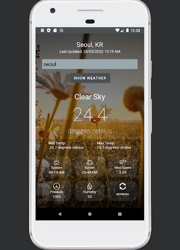

# WhatTheWeatherLike
WhatTheWeatherLike is a weather forecast app written in Kotlin and implemented in Android Studio.

[Video walkthough](https://youtu.be/v5kboZLkAmA)

## Requirements
- Android Studio
- Java 11
- Android device or create an Android Emulator on Android Studio

## Features 
- Use [OpenWeatherApp](https://openweathermap.org/api) API to search for specific location
- Use Google Play Services API to access user's current location
- Use Android Toast to create alert pop-ups
- Hourly forecast including: Weather Conditions, Temperature, Sunset and Sunrise, WindSpeed, Pressure, Relative Humidity, Refresh button
- City/Country search
- Randomised background generator based on weather condition
- Fits landscape view

## Run your app
1. [Clone](https://www.geeksforgeeks.org/how-to-clone-android-project-from-github-in-android-studio/) this git repository into Android Studio
2. Connect to your Android device or create an Android Emulator 
3. Click the 'Run app' icon 
